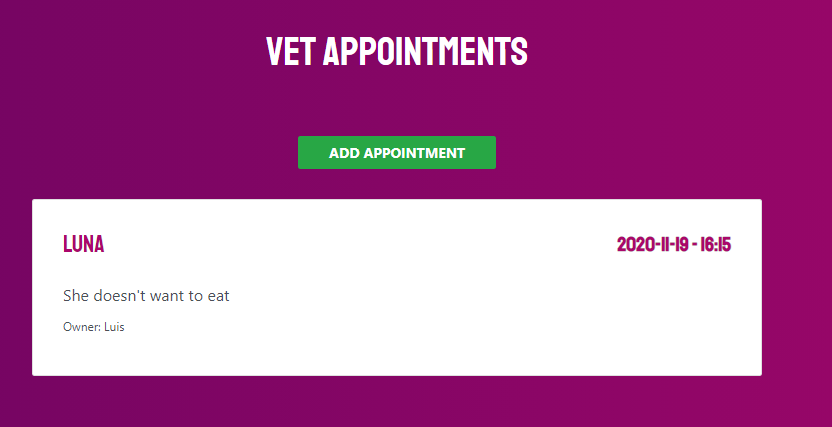

# Vet appointment manager

The project is a full-stack application developed in JS for managing the appointments vet.

The user is able to add, list, update, and delete an appointment by using an API REST.

## App description

As this is a full-stack application the project is composed by a fronted and a backendpart

### Backend

The backend has been developed using Express and MongoDB as database. It exposes the following APIs:

* POST: IP:PORT/patients - Adds a new appointment
* GET: IP:PORT/patients - Get a list of all the appointments
* GET: IP:PORT/patients:id - Get an appointment by its id
* UPDATE: IP:PORT/patients:id - Update an specific appointment
* DELETE: IP:PORT/patients:id - Delete a specific appointment

### Frontend

The frontend has been developed using React.

It provides a web interface to the users in order to add, store and delete appointments. The frontend uses axios to communicate with the backend.

  

